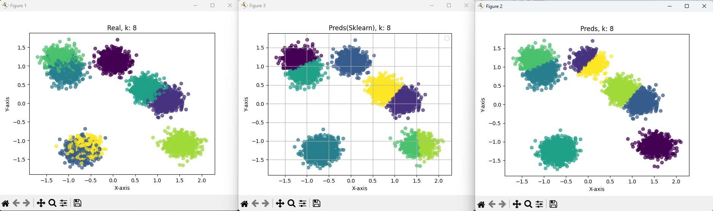
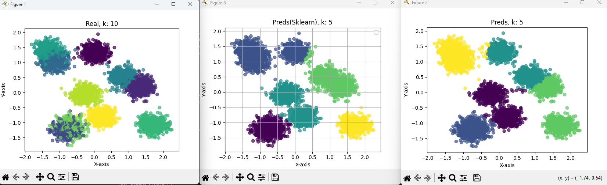

# Regularization Tests

## TODO: Recalculate with corrected mean std of scaler(after stddev typo fix from StandardScaler)

## Linear Regression

| Hyperparameter | Value | 
|----------------|---------------|
| Epochs | 10_000 | 
| Learning Rate | 0.0001 | 
| Lambda | 1e-4 | 

| Regularization | Training Loss | Test Loss |
|----------------|---------------|-----------|
| Without Regularization | 0.80**59157** | 0.8136**890** |
| With L1 Regularization | 0.80**61037** | 0.8136**782** |
| With L2 Regularization | 0.80**59584** | 0.8136**850** |

 

## Logistic Regression

| Hyperparameter | Value | 
|----------------|---------------|
| Epochs | 10_000 | 
| Learning Rate | 0.01 | 
| Lambda | 1e-6 | 

| Regularization | Train Loss |  Training Accuracy | Test Accuracy | Test Precision | Test Recall | Test F1 Score | 
|----------------|---------------|---------------|-----------|-----------|-----------|-----------|
| Without Regularization | 0.2385 | 89.6667% | 72.0000% | 0.8074 | 0.7800 | 0.7735 |
| With L1 Regularization | 0.2385 | 89.6667% | 72.0000% | 0.8074 | 0.7800 | 0.7735 |
| With L2 Regularization | 0.2385 | 89.6667% | 72.0000% | 0.8074 | 0.7800 | 0.7735 |

- Compare Results With Scikit-Learn Implementation(Check if that also has not meaningful change with different setups)

### MultiClass Classification With Logistic Regression

    - Setup with 0.1 lr, 1e-6 lambda L2 Regularization, Full-Batch GD and 10000 epochs, loss and acc becomes meaningful nearly at epoch>7k.
    - Loss decreases too slow with lr<0.1 makes model to learn nearly impossible which stucks at high loss and low acc with 10k epochs.
    - Probably needs mini-batch gradient descent or better optimization algorithm than Vanilla GD
        - TODO: Implement SGD with Momentum on mini batches, if necessary other optimizers too.

| Learning Rate | Train Loss |  Training Accuracy | Test Accuracy | Test Precision | Test Recall | Test F1 Score | Epochs |
|----------------|---------------|---------------|-----------|-----------|-----------|-----------|-----------|
| 0.01 | 1.3480 | 13.0% | 8.0% | 0.3000 | 0.0800 | 0.1263 | 10_000 | 
| 0.1 | 0.8432 | 80.0% | 80.0% | 0.8769 | 0.8000 | 0.7738 | 10_000 |

## KMeans Initial Implementation Results

#### With k=5

#### With k=12

#### With k=5 but make_blob with 10 centers 

#### Sklearn Comparison With k=8 

#### Sklearn Comparison With k=5 but make_blob with 10 centers 
